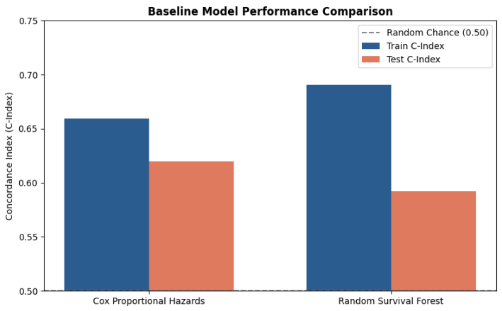
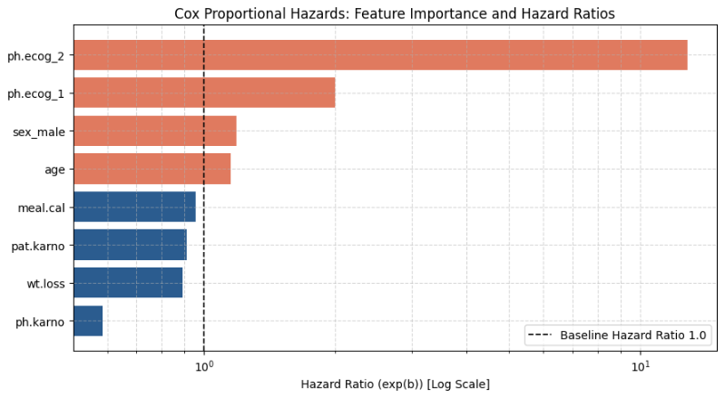

# LUNG-CANCER-ANALYSIS
> **End-to-End Clinical Risk Pipeline & Time-to-Event Survival Modeling**

## Overview
Lung cancer remains one of the most critical and common medical challenges worldwide. This project leverages Machine Learning and Survival Analysis to process complex clinical records, uncover subtle physiological patterns, and predict time-to-event outcomes. By analyzing clinical drivers and estimating individual survival probabilities over time, this pipeline provides actionable insights to support early clinical decision-making.

---

## Project Architecture

### Phase 1: Binary Mortality Classification (Synthetic Kaggle Data)
* **Objective:** Predict binary survival outcomes ($0$ or $1$) using demographic and lifestyle risk factors.
* **Data Source:** Synthetic Lung Cancer Dataset (Kaggle).
* **Tech Stack:** Python (`scikit-learn`, `pandas`, `numpy`), Matplotlib.
* **Models:** Logistic Regression, Random Forest Classifier.
* **Metrics & Output:** Accuracy, Recall, F1-Score (prioritizing False Negative minimization).

### Phase 2: Time-to-Event Survival Analysis (Real NCCTG Clinical Data)
* **Objective:** Model exact mortality trajectories over time while handling right-censored trial observations (patients alive at study end or lost to follow-up).
* **Data Source:** **NCCTG Lung Cancer Dataset** ($N=228$, Mayo Clinic).
* **Tech Stack:** Python (`scikit-survival`, `lifelines`, `scikit-learn`, `pandas`, `numpy`).
* **Models Evaluated:** Cox Proportional Hazards (Parametric) vs. Random Survival Forest (Non-Parametric).

---

## Key Results & Clinical Insights

| Estimator Model | Train C-Index | Test C-Index | Key Characteristic |
| :--- | :---: | :---: | :--- |
| **Cox Proportional Hazards** | **0.6591** | **0.6199** | **Top Performer** (Best generalization on $N=228$) |
| **Random Survival Forest** | 0.6908 | 0.5922 | Overfit due to small sample node splitting |

### Core Clinical Findings
* **Primary Risk Factor:** Physician-assessed functional decline (`ph.ecog_2+`) is the single strongest mortality driver (**Hazard Ratio $\approx 12.84$**), increasing death hazard nearly 13-fold compared to active patients.
* **Protective Metric:** High physician Karnofsky performance scores (`ph.karno`, **$\text{HR} \approx 0.59$**) significantly reduce hazard risk, directly correlating with extended patient survival.
* **Model Benchmark:** Cox PH outperformed Random Survival Forest on held-out test data, confirming that parametric linear estimators generalize better on smaller clinical cohorts.

---

## Pipeline Engineering & Leakage Firewall

1. **Stratified Split:** Executed an 80/20 train/test split stratified by mortality `status` to lock in identical event-to-censored ratios across both sets.
2. **Leak-Free Transformations:** Built a Scikit-Learn `ColumnTransformer` fitted strictly on training data:
   * **Numeric Features:** `KNNImputer(n_neighbors=5)` $\rightarrow$ `StandardScaler()`
   * **Categorical Features:** `OneHotEncoder(drop='first')`
3. **Structured Target Construction:** Zipped event booleans and observation times into structured NumPy arrays (`dtype=[('Status', '?'), ('Time', '<f8')]`) to feed low-level survival estimators directly.

---

## Key Visualizations

### 1. Model Performance Benchmark
 

*Train vs. Test Concordance Index (C-Index) demonstrating Cox PH superiority (0.62) over Random Survival Forest (0.59).*

### 2. Predicted Individual Patient Trajectories


*Predicted step-function survival probability curves S(t) comparing high-risk vs. low-risk patient trajectories over time.*

### 3. Hazard Ratio Feature Importance


*Log-scale hazard ratio chart highlighting primary mortality drivers (ph.ecog_2+) and protective indicators (ph.karno).*).

---

## Repository Structure
```text
├── Phase 1 Notebooks/
│   └── Data Loading, First Look and EDA
│   └── Data Splits
│   └──Baseline Modeling and Benchmark
├── Phase 2 Notebooks/
│   └── EDA and Censoring Audit
│   └── Lung Cancer Survival Modeling
├── README.md
└── requirements.txt

